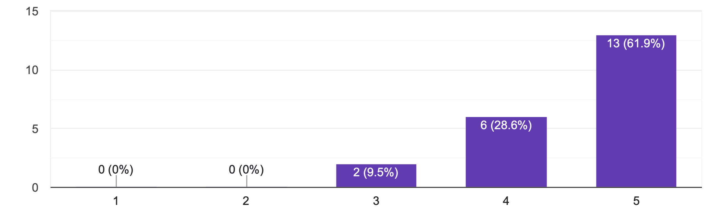

# 第一回AHCをみんなで解く会コンテストのアンケート（回答）
## Q1. 参戦者ですか？観戦者ですか？
参戦者17名、観戦者4名の方々から回答を頂きました。

## Q2. 今回のコンテストをどれぐらい楽しめましたか？

みなさん楽しんで頂けて大変うれしいです。評価５をつけていただいた方々には、さらにのめるこめるような工夫を、評価３をつけた方々の意見は丁重に受け止めて、今度は楽しめるようなコンテストを企画できるようにしていきたいです。

## Q3. Q1の理由について、当てはまるものを選んでください。(複数選択可)
### ポジティブな意見
#### ■点数が上がるのを楽しめた(13票)
1番多い意見でした。
アルゴとヒューリスティックの1番の違いですよね！
正解はなく、ひたすら突き進むのみ。
アルゴリズムを適用するだけでは点数が上がらず、
何が起きているのか理解するのが必要だけど、
なんとビジュアライザも用意されている！
素晴らしい環境だと思います。もっと流行れー！

#### ■チームで協力できた(12票 + 2票？)
  - わちゃわちゃした雰囲気
  - 孤独じゃなかった
特に長期AHCに出ているととにかく今の状況を誰かに話したくなるわけで、
チーム戦絶対楽しいだろうな、と思っていました。

辛いことはみんなで分散、
いいアイデアはもっと掘り下げて何倍にもなる、
楽しいチーム戦、これからも企画頑張ります！

#### ■色々な議論を読めた(10票)
AHCあるあるで、コンテスト終了直前には
「ぜぇったい復習(復讐)してやる…」
の気持ちでいっぱいになるんですが
いざ終わってみるとシャボン玉のように消え去っていくんですよね。
コンテスト期間中の議論、しかも色んなレート帯での議論を読めたのは
私も楽しかったです！

#### ■長期コンテストで長く楽しめた(8票)
長期コン、たくさんありすぎても体がいくつあっても足りなくなるんですが、
1週間のコンテストはちょうどいい期間設定だというアンケートもあり(要出典)

### ネガティブな意見
#### ■予定が合わなかった(3+1票)
「最初に考えていたよりも時間と確保することができず思うように作ることができなかった」を含みます
これはすみません、今回勢い重視で参加募集から開催まで1日という
乱暴な運営をしたので、そのせいです…

#### ■点数が上がらなかった(2票)
途中から燃え尽き気味になった、も含みます(「点数が上がらなかった」を選択していたため票数には加えず)
個人的にはここがヒューリスティックの中毒性に関わる部分なんじゃないかなと思うんですが(敗北の脳汁)
何度提出を重ねても点数が上がらないのを見続けるのは辛いですよね…

#### ■ナニモワカラナかった(1票)
ナニモワカラナイ人のために立ち上げました！
どんどん議論が進んでいく中、今更聞けない…
ってことを質問しやすい環境づくりを目指します！

#### ■周囲のプレッシャーを強く感じ、苦しいとも思った(1票)
チーム戦の影の面ですね、これはぜひKagglerの皆様に
質問してみたいことでもあります！
どんな雰囲気でチーム議論してるんでしょ。

## 次のうち、読みたい記事はどれですか？(複数選択可)
#### ■高得点コードの解説(11+1票)
「高得点じゃなくても、実装と解説」を含む
#### ■コード管理の仕方(10票)
#### ■ローカルテスト(8票)
#### ■公式ビジュアライザの実装の解説(5票)
#### ■今回のサンプルコードの解説(2票)

## やってみたいコンテストはどれですか？(複数選択可)

#### ■今回と同じ方式(チーム戦)(17票)
#### ■kaggle形式(個人戦、情報共有可、チームマージあり)(8票)
#### ■ビジュアライザ自作コンテスト(7票)
#### ■コード管理コンテスト(git、日記など管理の美しさを競う)(5票)
#### ■大人数のグループ2つくらいに分けて、あらゆる知識総動員して目標点(本番10位相当とか)を狙うボスレイド的なやつ。
#### ■グループごとに解答コードと悪質テストケースを作成して合計点を競う(コーナーケースへうまく対応できるか)
#### ■「焼きなましを実装してみよう」みたいな特定の解法縛り
#### ■指導者と生徒を決めて、指導者はアドバイスを行い、生徒が改善・提出する形式。

## 他に今後へ向けての改善点があれば教えてください。
  - 企画お疲れさまでした、眺めているだけでも楽しかったです。 知人にチームでマラソンをやりたいと言っている人が何人かいるので、固定メンバーで参戦できるとありがたいかもしれません。
  - 短期長期いずれもやっていきたいです．
  - 是非長く続く企画になればなと思っています。是非チーム体制を組んでゆるく運営してください！ありがとうございました！以前にやったことある問題でしたがぜんぜんしゃぶり足りなかったです。何回やっても楽しそうですね。
  - ainemさん運営本当にお疲れさまでした。とっても楽しませていただきました！ いつもはAHCは解法言及できずムズムズするのですが、チームで共有するのは予想以上に楽しかったです。  以下、感想です。 ・他の人の考察やコード見ながらやるのが新鮮でとても楽しかったです ・後半、勝手に実装意欲が低くなってしまい点数伸ばせず、チームの人に申し訳なさがありました ・他の人のコードのコピペ、個人によって全然OK！って人とコピペはちょっと…って人の感覚が違いそうなので事前に決めてあると楽かも？ ・サンプルコードがあるのは参加ハードルグッと下がるのですごくうれしかったです  最後に、本当に本当に最高の企画&神運営でした！ありがとうございましたー！
  - 楽しめました！ありがとうございます！また開催してください！！！！！！！
  - やはりチームと個人のバランス調整だと思います。ぱっと思いつくのはチーム参戦希望か個人参戦希望かで振り分ける、とかでしょうか？
  - 平日終了ではなく土日終了のほうが最後の頑張りを楽しめて良さそうです。
  - 運営お疲れ様でした！今後の継続開催に向けて、今回の運営で気になったことや気をつけたこと等をもとに、改善を繰り返していくための議論のタイミングがあると良いと思います。
  - みんなまじめで、高得点とっちゃう（対戦形式だった）のでどんどん新規参入が難しくなりそうです。あまり点数を気にせず初心者も高い点数取れない人も気軽に参加できる雰囲気になればいいなと思っています。
  - よく準備された素晴らしいコンテストだったと思います。お疲れ様でした！
  - チームの組み方をレーティングの色でというのはよかったと思いますが、まだ差が大きかった気がします。同じくらいの力だとより楽しめそうです。また、下のレーティングの人にはアドバイザーをつける等して、チーム間の力の差を調整できるとさらによいかもしれません。

## 総括(随時追加します)
この集まりでは競技としてチーム戦を楽しみたい勢が**多数**なので、今後の方針を単純に多数決のように決めていくつもりはありません。しかしながら、**今回と同じ形式**(改善すべきは改善します)のコンテストは定期的に続けていきたいと考えています！

この鯖を立ち上げた動機に近いのは少数派の意見なので、次回のコンテストは競技性の少ないものにしたいです。個別の回答への反応は、もう少し時間をください…＞＜
