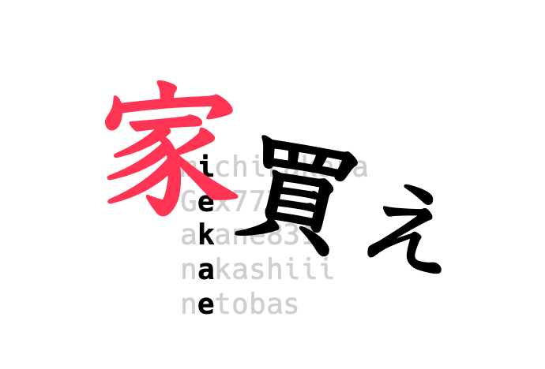
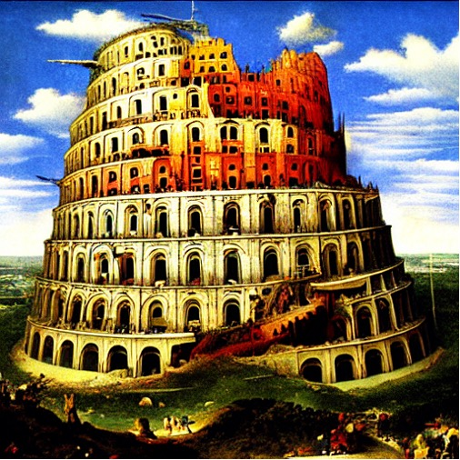
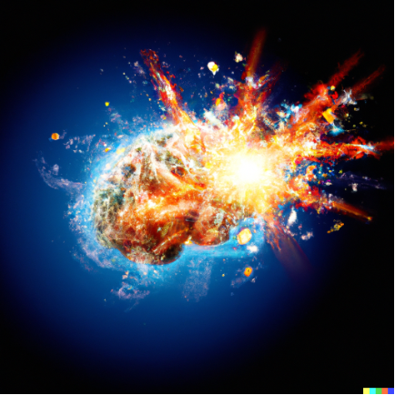
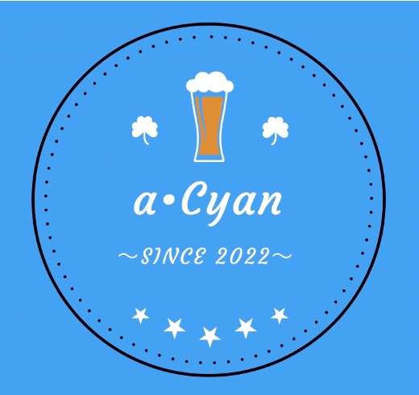
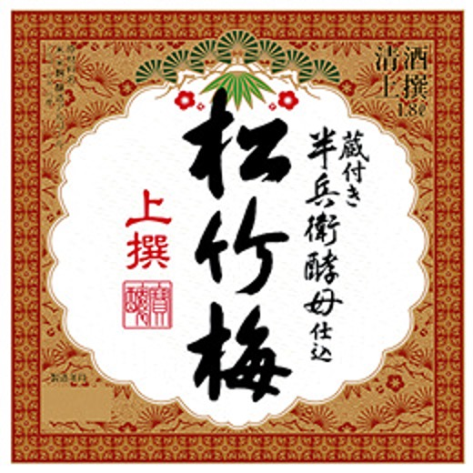

<strong>家買え</strong>

|ID|name|A|H|color|language|
|-|-|-|-|-|-|
|michirakara|michirakara|茶|茶|茶|python|
|Gex777|スコテイ(Gex777)|緑|黒|緑|cpp|	
|akane831|akane831|緑|緑|緑|cpp|
|nakashiii|nakashiii|緑|茶|緑|cpp|
|netobas|netobas|緑|黒|緑|python|

<strong>バベルクライマーズ</strong>

|ID|name|A|H|color|language|
|-|-|-|-|-|-|
|murasho|murasho|茶|灰|茶|cpp|
|meowmeowcats|あべみ|緑|灰|緑|python|
|r3yohei|ぱらぼろ|茶|緑|緑|rust|
|fujikawahiroaki|fujikawahiroaki|茶|緑|緑|crystal

<strong>ブレインバクハーズ</strong>

|ID|name|A|H|color|language|
|-|-|-|-|-|-|
|negibose2020|negibose2020|緑|	水|	水	|python|
|gengar_094|まぐげんがー|緑|	水|	水	|cpp ruby python|
|hiraku|hiraku|水|	緑|	水	|python rust|
|tnodino|Natno|水|	茶|	水	|python|

<strong>a･Cyan</strong>

|ID|name|A|H|color|language|
|-|-|-|-|-|-|
|kaede2020|kaede2020|茶|	水|	水|	cpp|
|jabee	  |jabee|水|	茶|	水|	cpp|
|jaku	  |jakusw|水|	水|	水|	python|
|take911  |たけ|緑|	水|	水|	python|

<strong>松竹梅</strong>

|ID|name|A|H|color|language|
|-|-|-|-|-|-|
|takekinmkk	|たけきー|青|水|青|	cpp|
|ponjuice	|ぽんじゅーす|青|青|青|	cpp|
|matsu7874	|matsu7874|水|水|水|	rust|
|keroru	    |keroru|青|水|青|	python|
